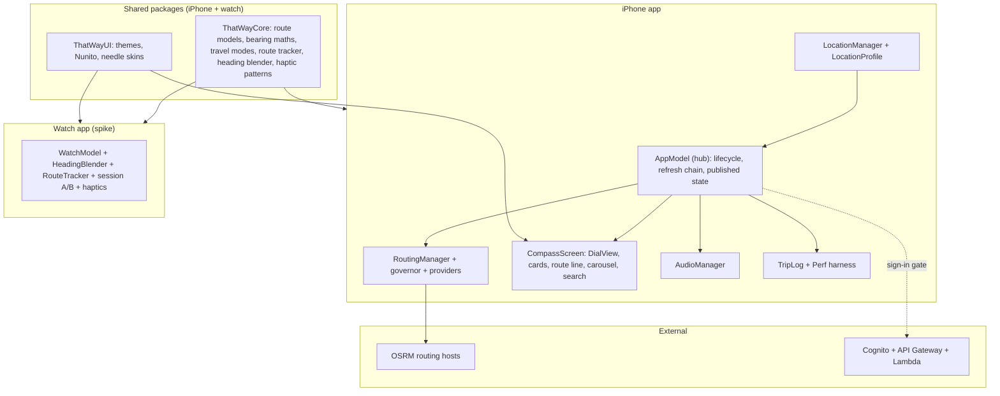

# Architecture map

## How to read it
- **AppModel is the hub.** Almost every feature reaches the screen or the speaker through it, which is why [[guidance-mode]] and [[redraw-model]] are rated high risk.
- **The seams that have broken before** (each is a real bug found while building): heading not republishing in idle ([[dial-view]]), keyboard resizing the layout ([[compass-screen-layout]]), a wrapped angle spinning the dial ([[continuous-angle]]), routing from a guessed position ([[location-issues]]), the compass check running when idle ([[compass-health]]).
- The areas are listed in [[00 Start here]]; the per-feature dependency arrows live in each note and in `_generated/Dependency matrix`.
