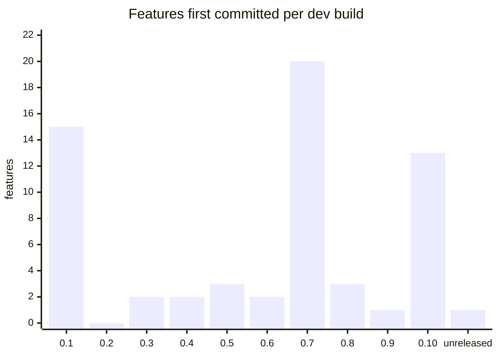

# Build timeline

> Generated by `scripts/vault/check_vault.py --write`. Do not edit by hand.

Internal dev builds (see `scripts/vault/versions.json`). These are not App Store versions: the public v1.0 is still ahead ([[P1 Stages and the MVP line]]).

## Build 0.1 (2026-09-14): First SwiftUI screens, real location, compass and routing managers

[[arrival]], [[avatars-social-decor]], [[bearing-math]], [[compass-screen-layout]], [[dial-view]], [[guidance-mode]], [[heading]], [[location-manager]], [[map-tab]], [[point-mode]], [[search-ui]], [[settings-profile]], [[store-skins]], [[tab-bar]], [[theme-system]]

15 feature(s).

## Build 0.2 (2026-09-15): Compass screen to spec, glass dial, layout and search polish

(no features first committed here)

0 feature(s).

## Build 0.3 (2026-09-16): Real OSRM routing, idle mode, Dynamic Type

[[route-models]], [[route-progress]]

2 feature(s).

## Build 0.4 (2026-09-17): OSRM geometry with per-step bearing; real search, location and routing

[[destination-search]], [[off-route-reroute]]

2 feature(s).

## Build 0.5 (2026-09-19): Guidance line, adaptive zoom, store and profile

[[persistence-defaults]], [[route-data-generator]], [[route-line]]

3 feature(s).

## Build 0.6 (2026-09-23): ETA, condensed guidance cards, arrival tracking

[[eta]], [[guidance-cards]]

2 feature(s).

## Build 0.7 (2026-10-05): Travel modes, tilt, audio, power tuning, dead reckoning, device readiness

[[audio-cue-plan]], [[audio-manager]], [[auth]], [[backend-config]], [[backend-lambda]], [[background-guidance]], [[compass-tilt]], [[dead-reckoning]], [[friends]], [[haptics-ios]], [[location-issues]], [[location-profile]], [[mode-change-reroute]], [[perf-harness]], [[route-failure]], [[route-persistence]], [[routing-governor]], [[routing-provider-seam]], [[travel-mode-carousel]], [[travel-modes]]

20 feature(s).

## Build 0.8 (2026-10-05): Search fix, compass health, card split, dial wrap fix

[[compass-health]], [[continuous-angle]], [[redraw-model]]

3 feature(s).

## Build 0.9 (2026-10-05): On-device trip logging

[[trip-log]]

1 feature(s).

## Build 0.10 (2026-10-05): Apple Watch app, shared packages, feature map, compass fixes

[[core-package]], [[heading-blender]], [[phone-watch-link]], [[route-tracker]], [[synthetic-route]], [[watch-app]], [[watch-drive-guard]], [[watch-gestures]], [[watch-haptics]], [[watch-session]], [[watch-spike-log]], [[watch-travel-modes]], [[watch-voice-search]]

13 feature(s).

## Build unreleased (2026-10-09): Dynamic Type pass, auth hardening, resend-code flow, proximity (UWB) and watch relay

[[nearby-proximity]]

1 feature(s).

## Features first committed per build

