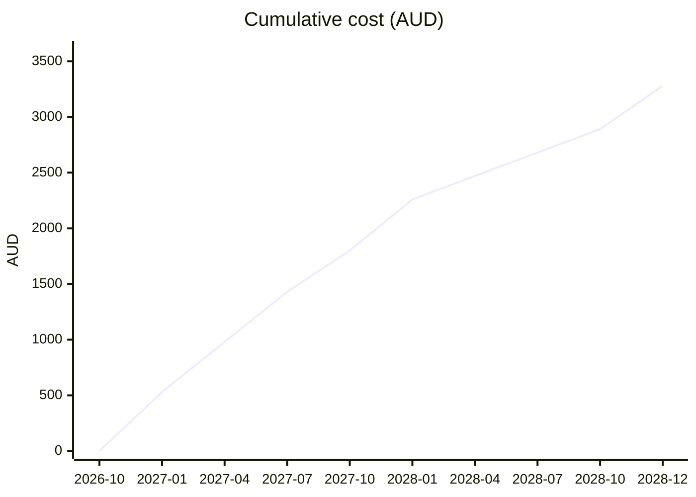
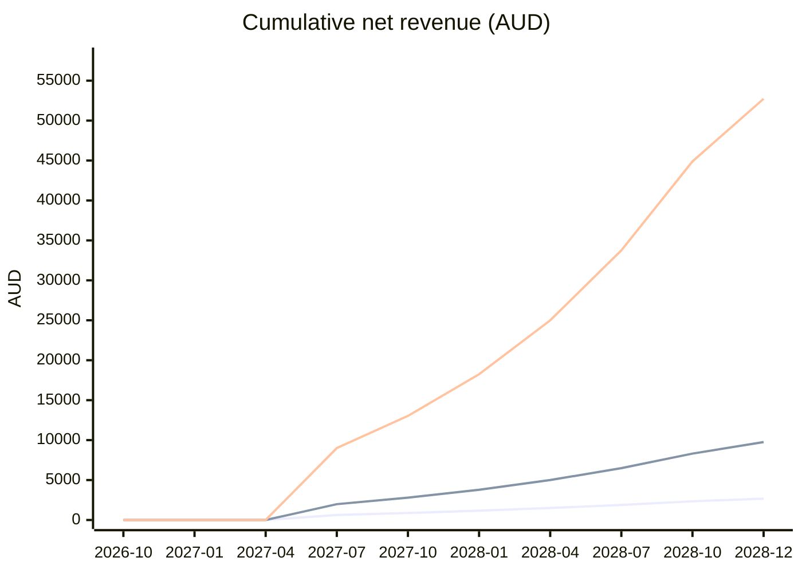
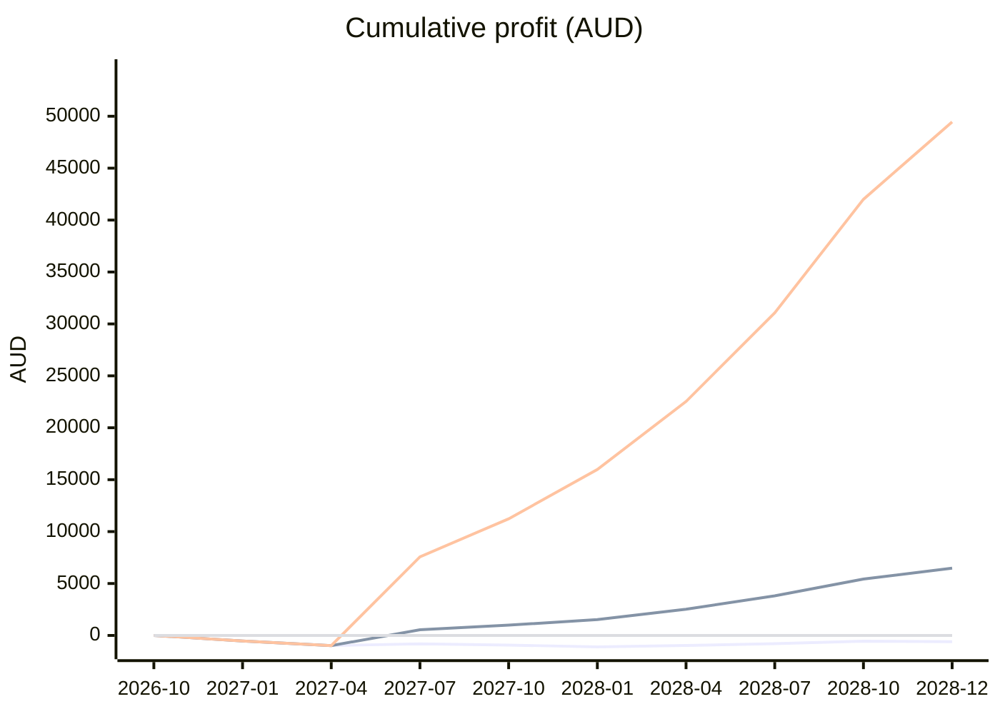
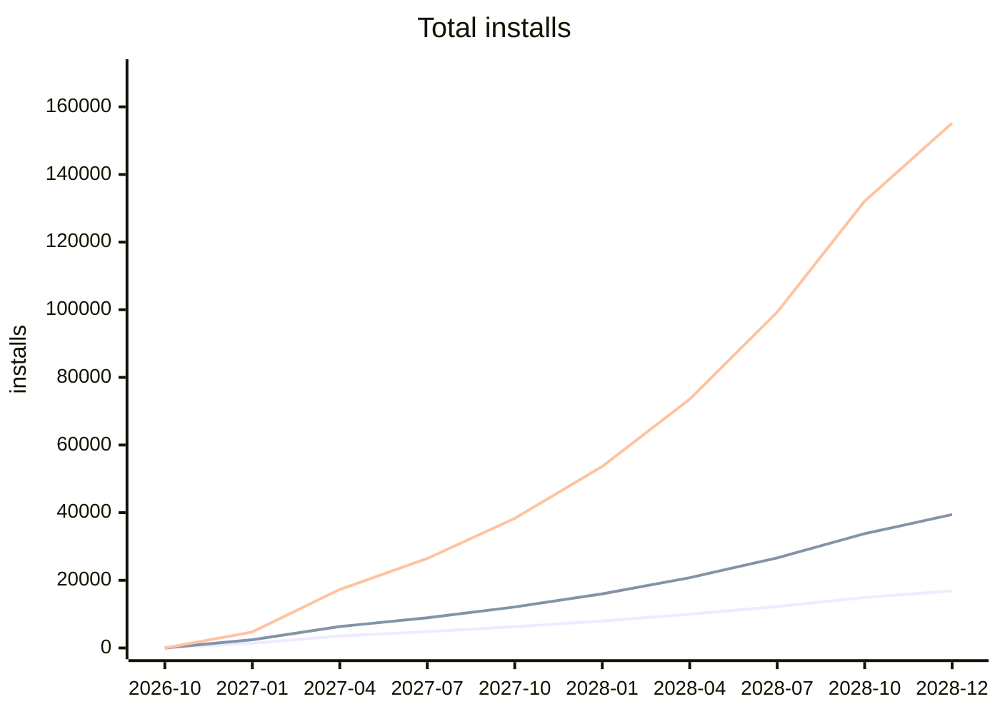
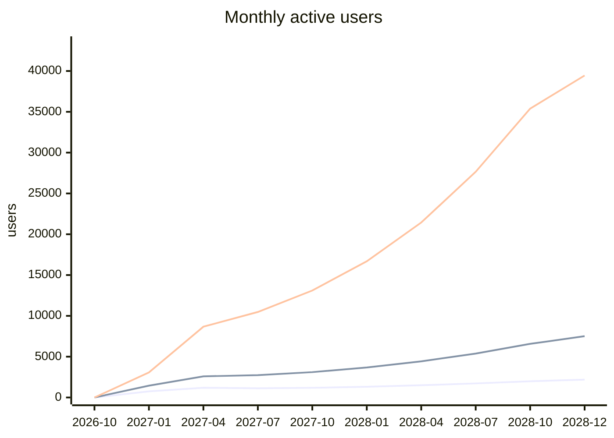

# Finance model

> Generated by `scripts/vault/model_finance.py --write` from `process/finance-assumptions.json`. Do not edit by hand: change the assumptions and regenerate.

**Read this first.** Costs come from the execution plan (its own caveat: estimates, not checked against current prices). Price, installs, conversion and retention are *assumptions*, not data. Three scenarios bracket your plan's own A$5k to A$25k a year. Replace the assumptions with real TestFlight and App Store numbers as soon as they exist.

## Assumptions in force

- Currency AUD; free v1.0 launch **2027-01**, paid tier (v1.1) **2027-05**
- Paid tier = one-time purchase at **AUD 9.99**, Apple keeps 15% (Small Business Program)
- Marketing = the smaller of the cap (AUD 800) and 1.0x first-year development cash, spread over 2026-12 to 2027-09

| Scenario | Installs at launch | Organic start /mo | Organic growth | Conversion | Retention /mo | Note |
|---|---|---|---|---|---|---|
| Conservative | 250 over 2 mo | 40 (cap 250) | 5% | 2% | 78% | Below the plan's own range: a quiet launch, little word of mouth. Target: A$1.5k net in the first 12 paid months. |
| Plan low | 700 over 2 mo | 120 (cap 700) | 7% | 3% | 82% | The bottom of the plan's stated range: A$5k net in the first 12 paid months. |
| Plan high | 2500 over 3 mo | 600 (cap 3500) | 9% | 4% | 85% | The top of the plan's stated range: A$25k net in the first 12 paid months. |

## Costs

| Item | Amount | Starts | Repeats |
|---|---|---|---|
| Apple Developer Program | AUD 150 | 2026-11 | yearly |
| Domain and website hosting | AUD 100 | 2026-12 | yearly |
| AWS, after credits and free tier | AUD 25 | 2026-11 | monthly |
| Routing server, if self-hosted | AUD 45 | 2027-01 | monthly |
| Marketing (earned from development spend, capped) | AUD 800 in total | 2026-12 | spread evenly |

First plan year (to 2027-09): development cash **AUD 930**, marketing **AUD 800**, total **AUD 1,730**. Contracting income is deliberately not modelled here.

*Quarterly points. Lines, in order: Cost.*

### Cost by month

| Month | Development | Marketing | Total | Cumulative |
|---|---|---|---|---|
| 2026-11 | 175 | 0 | 175 | 175 |
| 2026-12 | 125 | 80 | 205 | 380 |
| 2027-01 | 70 | 80 | 150 | 530 |
| 2027-02 | 70 | 80 | 150 | 680 |
| 2027-03 | 70 | 80 | 150 | 830 |
| 2027-04 | 70 | 80 | 150 | 980 |
| 2027-05 | 70 | 80 | 150 | 1,130 |
| 2027-06 | 70 | 80 | 150 | 1,280 |
| 2027-07 | 70 | 80 | 150 | 1,430 |
| 2027-08 | 70 | 80 | 150 | 1,580 |
| 2027-09 | 70 | 80 | 150 | 1,730 |
| 2027-10 | 70 | 0 | 70 | 1,800 |
| 2027-11 | 220 | 0 | 220 | 2,020 |
| 2027-12 | 170 | 0 | 170 | 2,190 |
| 2028-01 | 70 | 0 | 70 | 2,260 |
| 2028-02 | 70 | 0 | 70 | 2,330 |
| 2028-03 | 70 | 0 | 70 | 2,400 |
| 2028-04 | 70 | 0 | 70 | 2,470 |
| 2028-05 | 70 | 0 | 70 | 2,540 |
| 2028-06 | 70 | 0 | 70 | 2,610 |
| 2028-07 | 70 | 0 | 70 | 2,680 |
| 2028-08 | 70 | 0 | 70 | 2,750 |
| 2028-09 | 70 | 0 | 70 | 2,820 |
| 2028-10 | 70 | 0 | 70 | 2,890 |
| 2028-11 | 220 | 0 | 220 | 3,110 |
| 2028-12 | 170 | 0 | 170 | 3,280 |

## Revenue

| Scenario | Installs needed, first 12 months | Buyers, first 12 paid months | Net revenue, first 12 paid months | Cumulative net to 2028-12 | Cumulative profit to 2028-12 | Break-even month |
|---|---|---|---|---|---|---|
| Conservative | 7,384 | 177 | AUD 1,500 | AUD 2,679 | AUD -601 | not within the model |
| Plan low | 14,617 | 589 | AUD 5,000 | AUD 9,754 | AUD 6,474 | 2027-06 |
| Plan high | 48,098 | 2,944 | AUD 25,000 | AUD 52,732 | AUD 49,452 | 2027-05 |

*Quarterly points. Lines, in order: Conservative, Plan low, Plan high.*

## Cumulative profit (revenue minus cost)

*Quarterly points. Lines, in order: Conservative, Plan low, Plan high, Zero.*

## Users

| Scenario | Total installs by 2028-12 | Monthly active users then | Peak monthly installs |
|---|---|---|---|
| Conservative | 16,907 | 2,191 | 1,391 |
| Plan low | 39,442 | 7,514 | 2,921 |
| Plan high | 155,195 | 39,449 | 11,543 |

*Quarterly points. Lines, in order: Conservative, Plan low, Plan high.*

*Quarterly points. Lines, in order: Conservative, Plan low, Plan high.*
