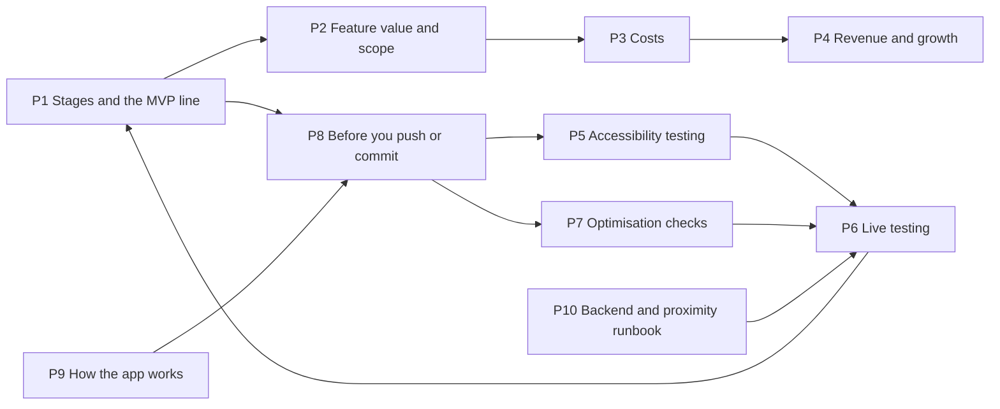

# Product development map

The second graph. The **operation graph** (features, flows, areas) answers *how the app works and what a change can break*. This one answers *how the product gets built, tested, shipped and paid for*. Together they are the bible: before any major or minor change, find the notes below, follow the checklists, and write down what you learned.

## Open the right graph
In Obsidian, open **Graph view** and type a filter in the search box at the top of the graph panel:

| Graph | Filter | What you see |
|---|---|---|
| Operation graph (features, dependencies, flows) | `path:features OR path:flows OR path:areas` | The 60-odd features and the arrows between them; colours show status and risk |
| **Development procedure graph** (this one) | `path:process` | The stages, playbooks and checklists below, linked in the order you use them |
| Everything | *(empty)* | Both, joined at the notes that cross over (for example [[nearby-proximity]]) |

Two ready-made canvases sit next to this note: **Development procedure.canvas** (the stages as a flow) and **Operation flow.canvas** (what happens from launch to arrival). Open them from the file list.

## The notes, in the order you will use them

| Note | Use it when |
|---|---|
| [[P1 Stages and the MVP line]] | Deciding what ships when, and whether a feature belongs in the MVP |
| [[P2 Feature value and scope]] | Judging whether a feature is worth its cost and risk |
| [[P3 Costs]] | Checking spend against the plan, or before adding a paid service |
| [[P4 Revenue and growth]] | Asking "what does the business look like if this works (or doesn't)" |
| [[P5 Accessibility testing]] | Any UI change; before every TestFlight build |
| [[P6 Live testing]] | Taking the app outside: field walks, drives, TestFlight, beta |
| [[P7 Optimisation checks]] | Measuring CPU, memory and battery on the SE 2nd gen |
| [[P8 Before you push or commit]] | Every commit and every push; the gate |
| [[P9 How the app works]] | Onboarding yourself (or anyone) to what the app does end to end |
| [[P10 Backend and proximity runbook]] | Anything touching AWS, sign-in, email, friends, UWB or the watch link |

## Generated companions (rebuilt by `python3 scripts/vault/check_vault.py --fix --write`)
- [[Feature ledger]]: every feature with first-commit date, dev build, release, CPU / memory / battery on the SE 2nd gen
- [[Build timeline]]: what landed in which internal dev build
- [[Performance evidence]]: how much of the cost has actually been measured (and what has not)
- [[Release scope]]: what each planned release contains; the MVP line
- [[Finance model]]: costs, revenue scenarios and user growth, from `process/finance-assumptions.json`

## What this vault will not do for you
- It is only as honest as what you put in. A number marked *predicted* has not been measured; a feature marked *spike* has not been proven on hardware. The checker enforces the shape, not the truth.
- It holds no coordinates, secrets, tokens or personal data, ever.

Back to [[00 Start here]].
