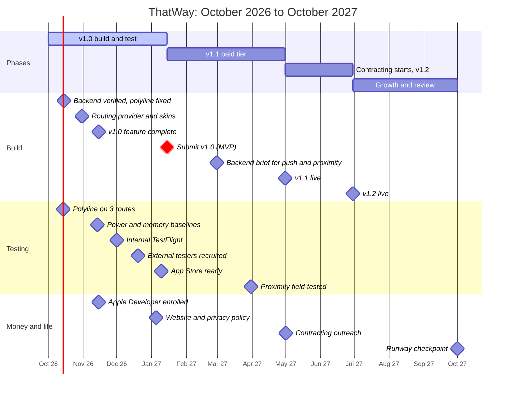

# Stages and the MVP line

Source of the dates: `thatway_execution_plan.html` (the milestones and phases in its data block). Status as of **2026-10-09**. Where this note and the plan disagree, the plan's dates win; update this note.

## The big picture

## Where the MVP line is
**The MVP is v1.0, submitted by 15 January 2027: free, core navigation and basic friends.** Everything above that line must work; everything below it must not be allowed to delay it.

Above the line (v1.0), by the [[Release scope]]:
- Pointing and guidance: [[point-mode]], [[guidance-mode]], [[route-progress]], [[off-route-reroute]], [[arrival]], [[guidance-cards]], [[dial-view]], [[travel-modes]], [[travel-mode-carousel]]
- Trust: [[heading]], [[compass-health]], [[location-issues]], [[route-failure]], [[background-guidance]]
- Getting in: [[destination-search]], [[auth]], [[friends]] (basic: add, accept, list)
- Foundations that must be solid: [[routing-provider-seam]], [[routing-governor]], [[redraw-model]], [[backend-lambda]]

Below the line:
- v1.1 (paid, by 30 April 2027): [[nearby-proximity]] (UWB), real-time friend tracking, push, in-app purchase and restore
- v1.2 (by 30 June 2027): skins and themes as data ([[store-skins]], [[theme-system]]), website sign-in offers
- Later: the watch app ([[watch-app]] and its notes, which the plan does not currently schedule), offline routing, creator skins

**Rule of thumb from the plan's own caveats:** January only holds if v1.0 stays core. Proximity and payments are v1.1. If a v1.0 task needs a v1.1 feature to be finished, the task is wrong, not the date.

## Stages and their gates
A stage is finished only when **every box in its gate is ticked and the evidence exists** (a file, a log, a note). "Done" without evidence is how a sign-up email that never arrives survives for weeks.

### S0. Prototype *(done, Sep 2026)*
Screens, real location, compass, OSRM routing. Evidence: builds 0.1 to 0.6 in [[Build timeline]].

### S1. Core build *(now: to 15 Nov 2026, milestone m03)*
Work: finish the v1.0 features; make sign-up and friends actually work against AWS; polyline correct on real roads.
Gate:
- [ ] Sign-up email arrives and the code confirms ([[P10 Backend and proximity runbook]]; `backend/scripts/smoke.sh` passes)
- [ ] Friends list, request, accept and remove work end to end on a device with the real `Config.apiBaseURL`
- [ ] Polyline matches the roads on 3 real routes: a drive, a walk, a roundabout (t01, due 14 Oct)
- [ ] Every v1.0 feature has `status: shipped` (not spike, dormant or setting-only) in [[Release scope]]
- [ ] No "none" in the high-risk rows of the [[Failure catalogue]] that you cannot justify in writing

### S2. Hardening *(Oct to 14 Nov 2026, milestone t02)*
Work: performance, accessibility, reliability. See [[P7 Optimisation checks]] and [[P5 Accessibility testing]].
Gate:
- [ ] A written power baseline per mode (walk, run, cycle, drive, idle) on the **device**, not only the simulator
- [ ] No memory growth over a 30-minute session
- [ ] Mean CPU while guiding at or under the target in `docs/perf-links.md` (1 % simulator)
- [ ] Accessibility pass at the largest text size, VoiceOver, Reduce Motion, contrast: recorded in [[P5 Accessibility testing]]
- [ ] [[Performance evidence]] shows no high-risk shipped feature without a battery figure

### S3. Internal TestFlight *(1 Dec 2026, t03)*
Needs the Apple Developer Program (c01, 15 Nov). Work: you plus 2 friends use it for real.
Gate:
- [ ] A full drive and a full walk with no crash
- [ ] Trip logs collected from every tester ([[P6 Live testing]]) and read
- [ ] Every crash and "that felt wrong" turned into a failure point in the vault, with the test that would have caught it

### S4. External beta *(to 20 Dec 2026 recruit, to 10 Jan 2027 finish, t04 and t05)*
Gate:
- [ ] 20 to 50 outside testers invited; feedback form live
- [ ] App Review dry run: no website mention, in-app unlock present, privacy labels and policy URL set (c02, 5 Jan)
- [ ] Screenshots, reviewer notes and the release checklist ready ([[P8 Before you push or commit]], release section)

### S5. Launch v1.0 *(15 Jan 2027, m04)*
Gate: your release checklist passes; submit. Marketing (k01 to k03) uses only numbers you measured.

### S6. v1.1 paid tier *(to 30 Apr 2027, m05, m06, t06)*
Work: backend brief (push, entitlements, proximity tokens), UWB on two friends' phones, in-app purchase and restore.
Gate:
- [ ] The new Lambdas are curl-tested (`backend/scripts/smoke.sh`) and in `deploy-backend.yml`
- [ ] UWB proven on two UWB phones (the SE 2nd gen cannot: see [[nearby-proximity]]); a Bluetooth fallback decision made
- [ ] Purchase and restore both work in the sandbox

### S7. v1.2 looks *(to 30 Jun 2027, m07)*
Gate: skins load from data, nothing hardcoded; website offers live (c03).

### S8. Growth and review *(to 1 Oct 2027, l03, l04)*
Gate: users, retention and the offline-routing decision written down ([[P4 Revenue and growth]]); the runway checkpoint decided: continue, adjust, or lean on contracting.

## Where we are right now (2026-10-09)
- Built: builds 0.1 to 0.10 plus an unreleased build (Dynamic Type pass, auth recovery, proximity, watch relay). 62 features, all counted in the [[Feature ledger]].
- Blocked on you: sign-up email and the friends API (AWS console steps in [[P10 Backend and proximity runbook]]); on-phone trip logs; watch on-wrist tests; Xcode account for the watch profile.
- The next date that matters: **14 Oct, polyline on 3 routes (t01)**.

## How to update this note
When a milestone is met, tick its gate boxes, add the evidence link, and move the "where we are" lines. When a date slips, change it here **and** in the plan, and write one line saying why.
