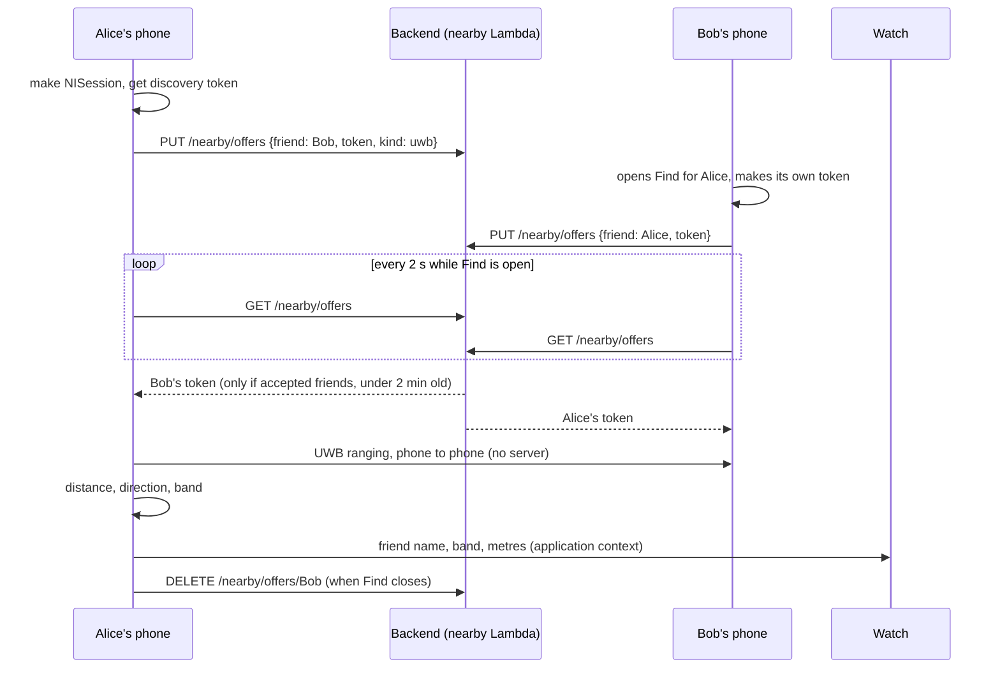

# Backend and proximity runbook

Everything about AWS, sign-in, the confirmation email, friends, the proximity (UWB) feature and the watch link, in one place, with what is **done**, what is **blocked on you**, and how to verify each step. The long console walkthrough is `backend/SETUP.md` (sections 1 to 11 the original build, **12 proximity, 13 email troubleshooting, 14 smoke test**).

## Status on 2026-10-09 (verified by probing Cognito's public API, no accounts created)
| Piece | State | Evidence |
|---|---|---|
| Cognito user pool and app client | **Live and reachable** | The client id answers; `USER_PASSWORD_AUTH` is enabled; email is the delivery medium; "prevent user existence errors" is on |
| Custom auth (Sign in with Apple) | Not configured | Cognito: "Custom auth lambda trigger is not configured". Expected; parked |
| **Friends API address** | **Not set.** `Config.apiBaseURL` is still `https://REPLACE_WITH_API_ID...` | `grep apiBaseURL ThatWay/Config.swift`. Every friends call fails until you paste the real invoke URL (with `/Dev`) |
| Confirmation email | **Unverified: this is the open problem** | Cannot be diagnosed from outside AWS: see "The email" below |
| App sign-up flow | **Fixed and tested** (resend code, unconfirmed sign-in recovery, clear errors) | `AuthManagerTests` |
| `nearby` Lambda (UWB token relay) | **Written and tested; not yet created in AWS** | `backend/lambda/nearby`, 16 checks pass under `jsc`; SETUP.md section 12 |
| Watch link | Phone to watch mode **and** proximity state | `WatchLink`, `PhoneLink`, tests in `ProximityTests` |
| UWB itself | **Cannot run on the test phone**: the iPhone SE has no UWB chip | see "UWB reality" |

## What only you can do (about an hour of console work)
Do these in order; each has a check.
1. **Find the API's invoke URL.** AWS Console, API Gateway, `ThatWay-api`, Stages, `Dev`, copy **Invoke URL**.
   - If there is no such API, SETUP.md section 6 builds it.
   - Put it in `ThatWay/Config.swift` as `https://<id>.execute-api.ap-southeast-2.amazonaws.com/Dev` (no trailing slash).
   - Check: `curl -s -o /dev/null -w '%{http_code}\n' "<that url>/friends"` prints **401** (the authorizer refusing a call with no token). 404 means the stage is missing from the URL; no response means a wrong id.
2. **Diagnose the email** (the next section). Until it works, create test users with the console's *Confirm account* action so you can keep testing.
3. **Create the proximity pieces** (SETUP.md section 12): the `NearbyOffers` table with TTL on `expiresAt`, the IAM addition, the `nearby` Lambda (upload `index.mjs` **and** `core.mjs`), and three routes on the same API with the same authorizer. Redeploy the `Dev` stage.
4. **Run the smoke test:**
   ```bash
   CLIENT_ID=2ute5p0mqgufhech5u59sn1is7 API=https://<id>.execute-api.ap-southeast-2.amazonaws.com/Dev \
     backend/scripts/smoke.sh <a confirmed username>
   ```
   It signs in, checks `/friends` and `/nearby/offers` work with a token and are refused without one, and that a stranger cannot receive a token. All `ok` and exit code 0 means the wiring is real.
5. **Tell the app and the watch.** Build and run on the phone; add a friend; open the compass screen and tap their picture (the Find sheet). On a non-UWB phone it must say so plainly.

## The email (why the code does not arrive)
The app side was checked end to end against Cognito's public API: sign-up, confirm, resend and unconfirmed-sign-in all behave. So a code that never arrives is Cognito or the mailbox. Work down this list and stop at the first hit:
1. **Is the user in the pool?** Console, Cognito, your pool, Users: status `Unconfirmed`? Then sign-up worked and only the email is missing. Absent? The app is pointed at a different pool.
2. **Unblock testing now:** select the user, Actions, **Confirm account**.
3. **Spam or junk.** Cognito's default sender is `no-reply@verificationemail.com`; Gmail and Outlook often junk it. The app's confirm screen now says so.
4. **The 50-a-day cap.** "Send email with Cognito" allows about 50 emails a day for the whole account. A day of testing can exhaust it; then a *resend* answers `LimitExceededException` and the app shows "Too many attempts". Wait until tomorrow or move to SES.
5. **Message settings.** Verification must be a **code** (not a link) and the template must contain `{####}`; attribute verification must include email.
6. **Switch to SES for anything real:** pool, Messaging, Email, *Send email with Amazon SES*. Verify a sender address or domain in SES (Sydney), then request **production access** (in the sandbox SES only delivers to verified recipients). About US$0.10 per 1,000 emails.
7. **SES evidence:** Sending statistics show sends, bounces, complaints; the suppression list explains one address that never receives anything.
If after all that it still fails, copy the pool's **Messaging** settings and the SES region and identity into a note here (no secrets) and compare with the list.

## Proximity (UWB): how it works

- The server learns **who is looking for whom and when**, nothing about where. Offers expire after 120 s and are deleted when Find closes.
- Only accepted friends can exchange tokens (the Lambda checks that the caller's own `Friends` row for that person is ACCEPTED, on write and again on every read).
- The phone shows the distance and bands (Right here, Very close, Close, Nearby, Farther away) with a haptic tick per band; if the hardware gives direction there is an arrow.
- The watch shows the friend's name and distance and taps the wrist as they get closer. The phone does the ranging; the watch only displays it.

### UWB reality (read this before promising it to anyone)
- **Ultra Wideband needs the U1 or U2 chip**: iPhone 11 and later, and Apple Watch Series 6 and later (not the Watch SE), but **no iPhone SE**. The test phone, an iPhone SE 2nd generation, cannot range at all, and neither can the simulator. The app says so instead of failing.
- To prove the feature you need **two UWB phones**. Milestone t06 (31 Mar 2027) says "UWB between 2 friends' phones, Bluetooth on the SE 2nd gen". Plan for borrowing two UWB phones, or deciding that the SE tier gets a Bluetooth-RSSI fallback (metre-level at best).
- Not built: push notification instead of polling, the Bluetooth fallback, camera-assisted direction (needs a camera permission), background ranging.
- The watch app cannot start ranging itself; it mirrors the phone's session.

## Watch and the backend
- The watch has **no sign-in and no AWS access**. It learns the phone's travel mode and proximity state over WatchConnectivity and routes with its own OSRM client. This is deliberate: no tokens on the wrist, no second account.
- The backend does not know the watch exists. If you later want the watch to read the friends list, send names from the phone over the same context; do not put a token on the watch.

## Failure and recovery cheat sheet
| Symptom | Likely cause | Action |
|---|---|---|
| "Friends aren't switched on yet" | `apiBaseURL` still the placeholder | Step 1 above |
| Every friends call "couldn't be reached" | API URL missing `/Dev`, or wrong id | `curl` check in step 1 |
| `{"message":"Unauthorized"}` | Access token expired or authorizer misconfigured | The app refreshes once and retries; if it persists, check the authorizer audience equals the app client id |
| Sign-in "Wrong username or password" for a user you just made | They never confirmed | The app now routes to the code step; or Confirm account in the console |
| Code step: "Too many attempts" | Email cap or throttle | Wait; move to SES |
| Find says "Not on this iPhone" | No UWB hardware | Expected on an SE |
| Find says "Waiting for ..." forever | The friend has not opened Find, or is not an accepted friend | Both open Find; check the friends list |
| Deploy workflow red on `nearby` | The function does not exist yet | Create it first |

Related: [[auth]], [[friends]], [[backend-lambda]], [[backend-config]], [[nearby-proximity]], [[phone-watch-link]], [[P8 Before you push or commit]].
