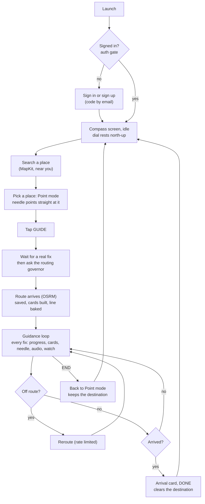

# How the app works

The whole operation in one read: what the user does, what the app does in response, which feature note owns each step, and where it can go wrong. The structure lives in [[01 Architecture map]]; the per-situation detail lives in the flows; this note is the narrative that ties them together. Read it once end to end, then use it as the index for any change.

## The product in one paragraph
ThatWay is a **compass for getting somewhere**: a big, calm dial whose needle points the way to your destination, with turn-by-turn cards, audio and haptic cues when you want them, for walking, running, cycling and driving. It works from your real location and heading, gets its routes from an OpenStreetMap routing service (OSRM), keeps working with the screen locked, and has friends (a small social layer) and a paired Apple Watch. The aim is to look at the phone as little as possible.

## One trip, end to end

## Step by step, with owners
| # | What the user sees and does | What the app does | Owner notes |
|---|---|---|---|
| 1 | Opens the app | Restores a saved login from the Keychain **without waiting for the network**, refreshes tokens in the background; restores an unfinished trip | [[auth]], [[route-persistence]], [[flow-first-launch]], [[flow-relaunch-restore]] |
| 2 | Signs in, or signs up and types a 6-digit code | Talks to Cognito directly; an unconfirmed account goes back to the code step; "Send a new code" | [[auth]], [[backend-config]] |
| 3 | Sees an idle dial and a search bar | Starts location and heading; shows a card if permission is denied, Precise is off, or there is no fix yet | [[location-manager]], [[location-issues]], [[heading]], [[dial-view]], [[compass-screen-layout]] |
| 4 | Types a place | MapKit search near the traveller; recents | [[destination-search]], [[search-ui]] |
| 5 | Picks it | Sets the destination, enters **Point mode**: the needle points along the bearing and shows the straight-line distance | [[point-mode]], [[bearing-math]], [[compass-tilt]] |
| 6 | Chooses a travel mode (carousel) | Mode picks the routing profile and every tuning value (corridor width, poll rate, arrival radius) | [[travel-modes]], [[travel-mode-carousel]] |
| 7 | Taps GUIDE | Starts the trip log, the scheduler, background modes; waits for a real fix (never routes from a guessed position); asks the governor for a route | [[guidance-mode]], [[trip-log]], [[background-guidance]], [[routing-governor]] |
| 8 | Watches a card appear | Governor rate-limits, retries with backoff, diagnoses failures (offline, timeout, no road); OSRM answers through a provider seam with a fallback host; the route is saved and turned into cards and a drawable line | [[routing-provider-seam]], [[route-failure]], [[route-models]], [[route-persistence]], [[route-data-generator]], [[guidance-cards]] |
| 9 | Walks or drives | Each fix advances progress along the route; dead reckoning smooths the readout between fixes; the card, distance, ETA, needle and audio cue update; the screen stays on and the phone keeps working locked | [[route-progress]], [[dead-reckoning]], [[eta]], [[audio-manager]], [[audio-cue-plan]], [[redraw-model]] |
| 10 | Sees the line on the map in the last stretch | The guidance line reveals the last stretch, trimmed as you pass it | [[route-line]], [[map-tab]] |
| 11 | Takes a wrong turn | Detects leaving the corridor, reroutes under the cooldown and cap | [[off-route-reroute]], [[flow-off-route]] |
| 12 | Changes mode mid-trip | Debounced; keeps the old route until the new one lands | [[mode-change-reroute]], [[flow-mode-change]] |
| 13 | The compass seems wrong | Compares the compass with GPS course on clean samples; if it disagrees twice, shows a warning and offers "Use GPS direction" and "Recalibrate" | [[compass-health]], [[flow-compass-wrong]] |
| 14 | Goes offline or locks the phone | Keeps the old route and shows a diagnosis, recovers by itself; background modes keep location and audio alive | [[flow-offline-midroute]], [[flow-phone-locked]] |
| 15 | Arrives | Fires within the mode's arrival radius; **DONE** ends the trip and clears the destination (back to idle); **END** mid-trip keeps the destination and returns to Point mode | [[arrival]], [[flow-arrival]] |
| 16 | Taps a friend's picture | Opens Find: two UWB phones measure the distance; the backend only relays one-off tokens between accepted friends | [[friends]], [[nearby-proximity]] |
| 17 | Wears a watch | The watch mirrors guidance with its own heading and haptics, refuses to guide if the phone is in Drive mode, and shows the friend's distance during Find | [[watch-app]], [[watch-drive-guard]], [[phone-watch-link]], [[watch-haptics]] |

## The ideas that make it work
- **AppModel is the hub.** Almost everything reaches the screen or the speaker through it, which is why [[guidance-mode]] and [[redraw-model]] are high risk. The cost of a published value is a redraw: the dial, the cards and the ETA are separate `Equatable` views fed plain values so only the piece that changed redraws.
- **Real data or an honest message.** The app never routes from a placeholder position, never pretends a failed route succeeded, and tells you when location, precision or the network is the problem.
- **Numbers, never places.** Logs, perf output and test files hold durations, counts and percentages; nothing records coordinates, routes or names.
- **Seams are swappable.** Routing sits behind a provider seam (one URL change moves it); the watch and phone share one package of pure maths ([[core-package]]) so both compute the same thing.
- **The user is the safety system.** The watch refuses in Drive mode; the screen stays on only while guiding; background location runs only during a trip.

## Where the data lives
| Data | Where | Lifetime |
|---|---|---|
| Login tokens | Keychain | Until sign-out or a server rejection |
| Active trip | `RoutePersistence` (one file) | Until arrival, END or clear |
| Preferences | `UserDefaults` (travel mode, recents) | Persistent. Theme, skin, tilt, units, default mode currently reset every launch ([[persistence-defaults]]) |
| Trip logs | `Documents/TripLogs` | Newest 60 trips; numbers only |
| Friends and accounts | AWS: Cognito, DynamoDB `Users` and `Friends` | Server side |
| Proximity offers | DynamoDB `NearbyOffers` | 2 minutes, then deleted |

## Where to go next
- What a change can break: [[Blast radius]] and the **Used by** list of the note you are touching.
- How to verify it: [[P8 Before you push or commit]].
- How to measure what it costs: [[P7 Optimisation checks]].
- What is missing or unproven: [[03 Known gaps]], [[Gaps]], [[Performance evidence]].

Back to [[P0 Product development map]].
